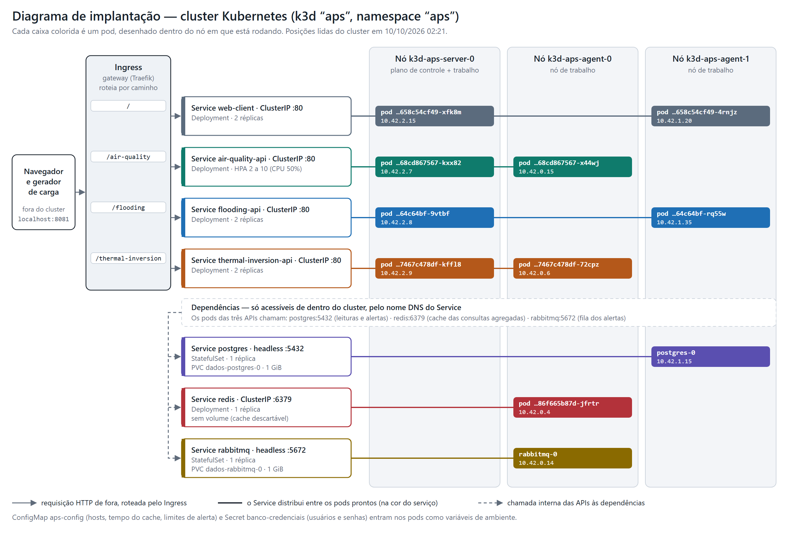

# Etapa 3 — Kubernetes: evidências e diagrama de implantação

Saídas reais dos experimentos da Aula Prática 3, rodados na aplicação do grupo num cluster k3d de 3 nós
(`k3d cluster create aps --agents 2 -p "8081:80@loadbalancer"`), em 10/10/2026.
Cada seção diz o que foi feito, mostra a saída coletada e o que ela demonstra.
Os comandos para subir tudo do zero estão no [README principal](../../README.md#kubernetes-etapa-3).

| # | Evidência | Passo da aula | Arquivo |
|---|---|---|---|
| 1 | Aplicação completa no cluster | 5 | `evidencias/01-aplicacao-completa.txt` |
| 2 | Distribuição das requisições por pod (`X-Pod`) | 6 | `evidencias/02-balanceamento-x-pod.txt` |
| 3 | Linha do tempo de um pod apagado | 7 | `evidencias/03-pod-apagado.txt` |
| 4 | Queda do banco: pods `0/1` com `RESTARTS 0` e dados preservados | 8 | `evidencias/04-queda-do-banco.txt` |
| 5 | Escala horizontal manual | 9 | `evidencias/05-escala-manual.txt` |
| 6 | Cache (Redis) e fila (RabbitMQ) | — | `evidencias/06-cache-e-fila.txt` |
| 7 | `kubectl top pod` e eventos do HPA | 10 | `evidencias/07-hpa.txt` |
| 8 | Diagrama de implantação | — | `diagrama-implantacao.png` / `.svg` |

## Diagrama de implantação

Quais pods, em quais nós, ligados por quais Services. As posições e os IPs foram lidos do cluster no mesmo
momento da evidência 1 (`kubectl get pods -o wide`); como o agendador decide onde cada pod roda, eles mudam
quando um pod é recriado.



- **Entrada única:** tudo de fora chega por `localhost:8081` ao Ingress (Traefik), que roteia por caminho
  para quatro Services: `/` (cliente web) e um prefixo por API.
- **Sem estado (Deployment):** o cliente web e as três APIs, com 2 réplicas cada, espalhadas pelos nós.
  A API de qualidade do ar tem HPA (2 a 10 réplicas).
- **Com estado (StatefulSet + PVC):** PostgreSQL e RabbitMQ, com nome de pod fixo e volume de 1 GiB.
  O Redis é um Deployment sem volume, porque cache é descartável.
- **Dependências:** banco, cache e fila não aparecem no Ingress; só os pods das APIs os alcançam,
  pelo nome DNS do Service.

Versão vetorial, para ampliar sem perder qualidade: [`diagrama-implantacao.svg`](diagrama-implantacao.svg).

## 1. Aplicação completa no cluster (Passo 5)

`kubectl get all,ingress,pvc,hpa -n aps -o wide` com a pilha inteira no ar: 11 pods `1/1 Running`,
os Services, o Ingress com os quatro caminhos, os dois PVCs `Bound` e o HPA.

Arquivo: [`evidencias/01-aplicacao-completa.txt`](evidencias/01-aplicacao-completa.txt)

```text
# Passo 5 - aplicação completa no cluster
# Coletado em 2026-10-10 02:21:11 (cluster k3d 'aps', namespace 'aps')

$ kubectl get nodes -o wide
NAME               STATUS   ROLES           AGE   VERSION        INTERNAL-IP   EXTERNAL-IP   OS-IMAGE           KERNEL-VERSION                      CONTAINER-RUNTIME
k3d-aps-agent-0    Ready    <none>          35m   v1.35.5+k3s1   172.18.0.5    <none>        K3s v1.35.5+k3s1   6.18.33.2-microsoft-standard-WSL2   containerd://2.2.3-k3s1
k3d-aps-agent-1    Ready    <none>          35m   v1.35.5+k3s1   172.18.0.4    <none>        K3s v1.35.5+k3s1   6.18.33.2-microsoft-standard-WSL2   containerd://2.2.3-k3s1
k3d-aps-server-0   Ready    control-plane   35m   v1.35.5+k3s1   172.18.0.3    <none>        K3s v1.35.5+k3s1   6.18.33.2-microsoft-standard-WSL2   containerd://2.2.3-k3s1

$ kubectl get all,ingress,pvc,hpa -n aps -o wide
NAME                                         READY   STATUS    RESTARTS   AGE   IP           NODE               NOMINATED NODE   READINESS GATES
pod/air-quality-api-68cd867567-kxx82         1/1     Running   0          33m   10.42.2.7    k3d-aps-server-0   <none>           <none>
pod/air-quality-api-68cd867567-x44wj         1/1     Running   0          30m   10.42.0.15   k3d-aps-agent-0    <none>           <none>
pod/flooding-api-64c64bf-9vtbf               1/1     Running   0          33m   10.42.2.8    k3d-aps-server-0   <none>           <none>
pod/flooding-api-64c64bf-rq55w               1/1     Running   0          58s   10.42.1.35   k3d-aps-agent-1    <none>           <none>
pod/postgres-0                               1/1     Running   0          25m   10.42.1.15   k3d-aps-agent-1    <none>           <none>
pod/rabbitmq-0                               1/1     Running   0          31m   10.42.0.14   k3d-aps-agent-0    <none>           <none>
pod/redis-86f665b87d-jfrtr                   1/1     Running   0          33m   10.42.0.4    k3d-aps-agent-0    <none>           <none>
pod/thermal-inversion-api-7467c478df-72cpz   1/1     Running   0          33m   10.42.0.6    k3d-aps-agent-0    <none>           <none>
pod/thermal-inversion-api-7467c478df-kffl8   1/1     Running   0          33m   10.42.2.9    k3d-aps-server-0   <none>           <none>
pod/web-client-658c54cf49-4rnjz              1/1     Running   0          20m   10.42.1.20   k3d-aps-agent-1    <none>           <none>
pod/web-client-658c54cf49-xfk8m              1/1     Running   0          20m   10.42.2.15   k3d-aps-server-0   <none>           <none>

NAME                            TYPE        CLUSTER-IP      EXTERNAL-IP   PORT(S)              AGE   SELECTOR
service/air-quality-api         ClusterIP   10.43.51.31     <none>        80/TCP               33m   app=air-quality-api
service/flooding-api            ClusterIP   10.43.174.233   <none>        80/TCP               33m   app=flooding-api
service/postgres                ClusterIP   None            <none>        5432/TCP             33m   app=postgres
service/rabbitmq                ClusterIP   None            <none>        5672/TCP,15672/TCP   33m   app=rabbitmq
service/redis                   ClusterIP   10.43.9.219     <none>        6379/TCP             33m   app=redis
service/thermal-inversion-api   ClusterIP   10.43.119.52    <none>        80/TCP               33m   app=thermal-inversion-api
service/web-client              ClusterIP   10.43.49.225    <none>        80/TCP               33m   app=web-client

NAME                                    READY   UP-TO-DATE   AVAILABLE   AGE   CONTAINERS   IMAGES                               SELECTOR
deployment.apps/air-quality-api         2/2     2            2           33m   api          aps-sd/air-quality-api:1.1.0         app=air-quality-api
deployment.apps/flooding-api            2/2     2            2           33m   api          aps-sd/flooding-api:1.1.0            app=flooding-api
deployment.apps/redis                   1/1     1            1           33m   redis        redis:7-alpine                       app=redis
deployment.apps/thermal-inversion-api   2/2     2            2           33m   api          aps-sd/thermal-inversion-api:1.1.0   app=thermal-inversion-api
deployment.apps/web-client              2/2     2            2           33m   nginx        aps-sd/web-client:1.1.0              app=web-client

NAME                                               DESIRED   CURRENT   READY   AGE   CONTAINERS   IMAGES                               SELECTOR
replicaset.apps/air-quality-api-68cd867567         2         2         2       33m   api          aps-sd/air-quality-api:1.1.0         app=air-quality-api,pod-template-hash=68cd867567
replicaset.apps/flooding-api-64c64bf               2         2         2       33m   api          aps-sd/flooding-api:1.1.0            app=flooding-api,pod-template-hash=64c64bf
replicaset.apps/redis-86f665b87d                   1         1         1       33m   redis        redis:7-alpine                       app=redis,pod-template-hash=86f665b87d
replicaset.apps/thermal-inversion-api-7467c478df   2         2         2       33m   api          aps-sd/thermal-inversion-api:1.1.0   app=thermal-inversion-api,pod-template-hash=7467c478df
replicaset.apps/web-client-658c54cf49              2         2         2       20m   nginx        aps-sd/web-client:1.1.0              app=web-client,pod-template-hash=658c54cf49
replicaset.apps/web-client-77b7d6864b              0         0         0       33m   nginx        aps-sd/web-client:1.1.0              app=web-client,pod-template-hash=77b7d6864b

NAME                        READY   AGE   CONTAINERS   IMAGES
statefulset.apps/postgres   1/1     33m   postgres     postgres:16-alpine
statefulset.apps/rabbitmq   1/1     31m   rabbitmq     rabbitmq:3.13-management-alpine

NAME                                                  REFERENCE                    TARGETS       MINPODS   MAXPODS   REPLICAS   AGE
horizontalpodautoscaler.autoscaling/air-quality-api   Deployment/air-quality-api   cpu: 3%/50%   2         10        2          2m4s

NAME                                CLASS     HOSTS   ADDRESS                            PORTS   AGE
ingress.networking.k8s.io/gateway   traefik   *       172.18.0.3,172.18.0.4,172.18.0.5   80      33m

NAME                                     STATUS   VOLUME                                     CAPACITY   ACCESS MODES   STORAGECLASS   VOLUMEATTRIBUTESCLASS   AGE   VOLUMEMODE
persistentvolumeclaim/dados-postgres-0   Bound    pvc-eb3a9e74-5113-414e-bd42-133ddfe72b64   1Gi        RWO            local-path     <unset>                 33m   Filesystem
persistentvolumeclaim/dados-rabbitmq-0   Bound    pvc-0a037d2c-6d13-45c6-9db1-37bd814e172d   1Gi        RWO            local-path     <unset>                 31m   Filesystem

$ kubectl get configmap,secret -n aps
NAME                         DATA   AGE
configmap/aps-config         8      33m
configmap/kube-root-ca.crt   1      33m

NAME                       TYPE     DATA   AGE
secret/banco-credenciais   Opaque   16     33m
```

**O que mostra:** os pods de cada API ficaram em nós diferentes; `RESTARTS` é 0 em todos; os PVCs do banco
e da fila estão ligados a volumes; o HPA lê a CPU (não está `<unknown>`), o que confirma o metrics-server.

## 2. Distribuição das requisições por pod (Passo 6)

Cada resposta leva o cabeçalho `X-Pod` (nome do pod que atendeu) e `X-Versao` (versão da imagem).
Foram feitas 20 requisições por serviço, pelo gateway, contando quantas cada pod atendeu.

Arquivo: [`evidencias/02-balanceamento-x-pod.txt`](evidencias/02-balanceamento-x-pod.txt)

```text
# Passo 6 - distribuição das requisições por pod (cabeçalho X-Pod)
# Coletado em 2026-10-10 02:21:13 (cluster k3d 'aps', namespace 'aps')

$ curl -si http://localhost:8081/air-quality/health/live | grep -iE '^HTTP|x-pod|x-versao'
HTTP/1.1 200 OK
X-Pod: air-quality-api-68cd867567-x44wj
X-Versao: 1.1.0

$ # 20 requisições em http://localhost:8081/air-quality/health/live, contadas por X-Pod
     10 X-Pod: air-quality-api-68cd867567-kxx82
     10 X-Pod: air-quality-api-68cd867567-x44wj

$ # 20 requisições em http://localhost:8081/flooding/health/live, contadas por X-Pod
     10 X-Pod: flooding-api-64c64bf-9vtbf
     10 X-Pod: flooding-api-64c64bf-rq55w

$ # 20 requisições em http://localhost:8081/thermal-inversion/health/live, contadas por X-Pod
     10 X-Pod: thermal-inversion-api-7467c478df-72cpz
     10 X-Pod: thermal-inversion-api-7467c478df-kffl8

$ # 20 requisições no cliente web (http://localhost:8081/), contadas por X-Pod
     10 X-Pod: web-client-658c54cf49-4rnjz
     10 X-Pod: web-client-658c54cf49-xfk8m

$ curl -s -o /dev/null -w '%{http_code}\n' http://localhost:8081/api/v1/air-quality/particulate   # sem o prefixo do gateway
404
```

**O que mostra:** 10 requisições para cada uma das duas réplicas, nos quatro serviços — o Traefik distribui
em rodízio (*round-robin*), requisição a requisição (balanceamento de camada 7). A última linha mostra que,
sem o prefixo do serviço, o gateway responde `404`: cada API só é alcançada pelo seu caminho.

## 3. Linha do tempo de um pod apagado (Passo 7)

Com `kubectl get pods -w` rodando, um pod da `flooding-api` foi apagado. A primeira coluna é a hora em que
cada linha apareceu.

Arquivo: [`evidencias/03-pod-apagado.txt`](evidencias/03-pod-apagado.txt)

```text
# Passo 7 - linha do tempo de um pod apagado até o substituto ficar 1/1
# Coletado em 2026-10-10 02:20:08 (cluster k3d 'aps', namespace 'aps')

$ kubectl get pods -n aps -l app=flooding-api -o wide
NAME                         READY   STATUS    RESTARTS   AGE   IP           NODE               NOMINATED NODE   READINESS GATES
flooding-api-64c64bf-5cfdk   1/1     Running   0          25m   10.42.1.12   k3d-aps-agent-1    <none>           <none>
flooding-api-64c64bf-9vtbf   1/1     Running   0          32m   10.42.2.8    k3d-aps-server-0   <none>           <none>

$ kubectl get pods -n aps -l app=flooding-api -w        # em outro terminal: kubectl delete pod -n aps flooding-api-64c64bf-5cfdk
# (a primeira coluna é a hora em que cada linha apareceu)
02:20:10.491  NAME                         READY   STATUS    RESTARTS   AGE
02:20:10.607  flooding-api-64c64bf-5cfdk   1/1     Running   0          25m
02:20:10.707  flooding-api-64c64bf-9vtbf   1/1     Running   0          32m
02:20:14.321  >>> kubectl delete pod -n aps flooding-api-64c64bf-5cfdk
02:20:14.635  flooding-api-64c64bf-5cfdk   1/1     Terminating   0          25m
02:20:14.747  flooding-api-64c64bf-5cfdk   1/1     Terminating   0          25m
02:20:14.992  flooding-api-64c64bf-rq55w   0/1     Pending       0          0s
02:20:15.105  flooding-api-64c64bf-rq55w   0/1     Pending       0          0s
02:20:15.226  flooding-api-64c64bf-rq55w   0/1     ContainerCreating   0          0s
02:20:15.874  flooding-api-64c64bf-5cfdk   0/1     Completed           0          25m
02:20:16.679  flooding-api-64c64bf-rq55w   0/1     Running             0          2s
02:20:16.794  flooding-api-64c64bf-5cfdk   0/1     Completed           0          25m
02:20:16.930  flooding-api-64c64bf-5cfdk   0/1     Completed           0          25m
02:20:21.487  flooding-api-64c64bf-rq55w   0/1     Running             0          7s
02:20:21.615  flooding-api-64c64bf-rq55w   1/1     Running             0          7s

$ kubectl get pods -n aps -l app=flooding-api -o wide
NAME                         READY   STATUS    RESTARTS   AGE   IP           NODE               NOMINATED NODE   READINESS GATES
flooding-api-64c64bf-9vtbf   1/1     Running   0          33m   10.42.2.8    k3d-aps-server-0   <none>           <none>
flooding-api-64c64bf-rq55w   1/1     Running   0          37s   10.42.1.35   k3d-aps-agent-1    <none>           <none>
```

**O que mostra:** ninguém mandou criar o pod novo. O ReplicaSet viu 1 pod onde deveriam existir 2 e criou
outro em menos de 1 segundo — o laço de controle. Do `delete` até o substituto ficar `1/1` passaram cerca
de 7 segundos; nesse intervalo o pod novo existiu como `0/1` (não pronto) e o Service não lhe mandou tráfego,
enquanto a outra réplica continuou atendendo. O pod novo tem outro nome e outro IP: o apagado não "voltou".

## 4. Queda do banco (Passo 8)

Três leituras foram gravadas; depois o banco foi desligado (`replicas=0`) e religado.

Arquivo: [`evidencias/04-queda-do-banco.txt`](evidencias/04-queda-do-banco.txt)

```text
# Passo 8 - queda do banco: readiness tira as APIs do balanceamento sem reiniciar; dados preservados
# Coletado em 2026-10-10 01:55:18 (cluster k3d 'aps', namespace 'aps')

$ curl -s 'http://localhost:8081/air-quality/api/v1/air-quality/particulate?stationId=EST-EVID-01'   # antes: 3 leituras gravadas
[{"id":306,"stationId":"EST-EVID-01","sensorId":"EST-EVID-01-PM","areaId":"EVIDENCIA","pm25":13.5,"pm10":23,"timestamp":"2026-10-10T04:55:19.861442+00:00"},{"id":305,"stationId":"EST-EVID-01","sensorId":"EST-EVID-01-PM","areaId":"EVIDENCIA","pm25":12.5,"pm10":22,"timestamp":"2026-10-10T04:55:18.958555+00:00"},{"id":304,"stationId":"EST-EVID-01","sensorId":"EST-EVID-01-PM","areaId":"EVIDENCIA","pm25":11.5,"pm10":21,"timestamp":"2026-10-10T04:55:18.843016+00:00"}]
$ kubectl scale statefulset postgres -n aps --replicas=0
statefulset.apps/postgres scaled

# 25 segundos depois:
$ kubectl get pods -n aps
NAME                                     READY   STATUS    RESTARTS   AGE
air-quality-api-68cd867567-kxx82         0/1     Running   0          8m12s
air-quality-api-68cd867567-lk27f         0/1     Running   0          45s
air-quality-api-68cd867567-x44wj         0/1     Running   0          4m56s
air-quality-api-68cd867567-xkplj         0/1     Running   0          45s
flooding-api-64c64bf-5cfdk               0/1     Running   0          65s
flooding-api-64c64bf-9vtbf               0/1     Running   0          8m12s
rabbitmq-0                               1/1     Running   0          6m18s
redis-86f665b87d-jfrtr                   1/1     Running   0          8m12s
thermal-inversion-api-7467c478df-72cpz   0/1     Running   0          8m12s
thermal-inversion-api-7467c478df-kffl8   0/1     Running   0          8m12s
web-client-77b7d6864b-bhn8t              1/1     Running   0          8m11s
web-client-77b7d6864b-zrffz              1/1     Running   0          8m11s

$ curl -s -o /dev/null -w '%{http_code}\n' 'http://localhost:8081/air-quality/api/v1/air-quality/particulate'
503

$ kubectl exec -n aps deploy/flooding-api -- wget -q -O - http://localhost:8080/health/live   # liveness continua respondendo
Healthy
$ kubectl scale statefulset postgres -n aps --replicas=1
statefulset.apps/postgres scaled

# banco de volta:
$ kubectl get pods -n aps
NAME                                     READY   STATUS    RESTARTS   AGE
air-quality-api-68cd867567-kxx82         1/1     Running   0          8m21s
air-quality-api-68cd867567-lk27f         1/1     Running   0          54s
air-quality-api-68cd867567-x44wj         1/1     Running   0          5m5s
air-quality-api-68cd867567-xkplj         1/1     Running   0          54s
flooding-api-64c64bf-5cfdk               1/1     Running   0          74s
flooding-api-64c64bf-9vtbf               1/1     Running   0          8m21s
postgres-0                               1/1     Running   0          7s
rabbitmq-0                               1/1     Running   0          6m27s
redis-86f665b87d-jfrtr                   1/1     Running   0          8m21s
thermal-inversion-api-7467c478df-72cpz   1/1     Running   0          8m21s
thermal-inversion-api-7467c478df-kffl8   1/1     Running   0          8m21s
web-client-77b7d6864b-bhn8t              1/1     Running   0          8m20s
web-client-77b7d6864b-zrffz              1/1     Running   0          8m20s

$ curl -s 'http://localhost:8081/air-quality/api/v1/air-quality/particulate?stationId=EST-EVID-01'   # depois: as mesmas 3 leituras
[{"id":306,"stationId":"EST-EVID-01","sensorId":"EST-EVID-01-PM","areaId":"EVIDENCIA","pm25":13.5,"pm10":23,"timestamp":"2026-10-10T04:55:19.861442+00:00"},{"id":305,"stationId":"EST-EVID-01","sensorId":"EST-EVID-01-PM","areaId":"EVIDENCIA","pm25":12.5,"pm10":22,"timestamp":"2026-10-10T04:55:18.958555+00:00"},{"id":304,"stationId":"EST-EVID-01","sensorId":"EST-EVID-01-PM","areaId":"EVIDENCIA","pm25":11.5,"pm10":21,"timestamp":"2026-10-10T04:55:18.843016+00:00"}]
$ kubectl get pvc -n aps
NAME               STATUS   VOLUME                                     CAPACITY   ACCESS MODES   STORAGECLASS   VOLUMEATTRIBUTESCLASS   AGE
dados-postgres-0   Bound    pvc-eb3a9e74-5113-414e-bd42-133ddfe72b64   1Gi        RWO            local-path     <unset>                 8m22s
dados-rabbitmq-0   Bound    pvc-0a037d2c-6d13-45c6-9db1-37bd814e172d   1Gi        RWO            local-path     <unset>                 6m28s
```

**O que mostra:**

- **`0/1 Running`, `RESTARTS 0`:** a readiness (que consulta o banco a cada chamada) falhou; a liveness
  (que só verifica o processo) continuou respondendo `Healthy`. Os pods saíram do balanceamento
  **sem serem reiniciados**.
- **`503` no gateway:** sem nenhum pod pronto, o Ingress recusa de forma limpa, em vez de devolver um erro
  `500` de dentro da aplicação.
- **Volta sozinha:** quando o banco retornou, a readiness passou e os pods voltaram a `1/1` sem intervenção.
- **Dados preservados:** o pod `postgres-0` foi destruído e recriado, mas as mesmas três leituras continuam
  lá, porque o volume `dados-postgres-0` não foi apagado.
- Redis, RabbitMQ e o cliente web não dependem do banco e ficaram `1/1` o tempo todo.

No momento desta coleta a API de qualidade do ar estava com 4 réplicas, por decisão do HPA.

## 5. Escala horizontal manual (Passo 9)

O HPA foi removido (ele desfaria a escala manual) e o Deployment da API de qualidade do ar foi de 2 para
4 réplicas com um comando.

Arquivo: [`evidencias/05-escala-manual.txt`](evidencias/05-escala-manual.txt)

```text
# Passo 9 - escala horizontal manual de 2 para 4 réplicas
# Coletado em 2026-10-10 02:01:25 (cluster k3d 'aps', namespace 'aps')

$ kubectl delete hpa air-quality-api -n aps        # o HPA desfaria a escala manual
horizontalpodautoscaler.autoscaling "air-quality-api" deleted from aps namespace

$ kubectl get pods -n aps -l app=air-quality-api -o wide        # antes: 2 réplicas
NAME                               READY   STATUS    RESTARTS   AGE   IP           NODE               NOMINATED NODE   READINESS GATES
air-quality-api-68cd867567-kxx82   1/1     Running   0          13m   10.42.2.7    k3d-aps-server-0   <none>           <none>
air-quality-api-68cd867567-x44wj   1/1     Running   0          10m   10.42.0.15   k3d-aps-agent-0    <none>           <none>

$ kubectl scale deployment air-quality-api -n aps --replicas=4
deployment.apps/air-quality-api scaled

$ kubectl rollout status deployment/air-quality-api -n aps --timeout=120s
Waiting for deployment "air-quality-api" rollout to finish: 2 of 4 updated replicas are available...
Waiting for deployment "air-quality-api" rollout to finish: 3 of 4 updated replicas are available...
deployment "air-quality-api" successfully rolled out

$ kubectl get pods -n aps -l app=air-quality-api -o wide        # depois: 4 réplicas
NAME                               READY   STATUS    RESTARTS   AGE   IP           NODE               NOMINATED NODE   READINESS GATES
air-quality-api-68cd867567-bssrp   1/1     Running   0          7s    10.42.1.21   k3d-aps-agent-1    <none>           <none>
air-quality-api-68cd867567-kxx82   1/1     Running   0          14m   10.42.2.7    k3d-aps-server-0   <none>           <none>
air-quality-api-68cd867567-rt9rl   1/1     Running   0          7s    10.42.1.22   k3d-aps-agent-1    <none>           <none>
air-quality-api-68cd867567-x44wj   1/1     Running   0          10m   10.42.0.15   k3d-aps-agent-0    <none>           <none>

$ # 20 requisições logo após a escala, contadas por X-Pod
      2 X-Pod: air-quality-api-68cd867567-bssrp
      6 X-Pod: air-quality-api-68cd867567-kxx82
      6 X-Pod: air-quality-api-68cd867567-rt9rl
      6 X-Pod: air-quality-api-68cd867567-x44wj

$ # 20 requisições 10 segundos depois, contadas por X-Pod
      5 X-Pod: air-quality-api-68cd867567-bssrp
      5 X-Pod: air-quality-api-68cd867567-kxx82
      4 X-Pod: air-quality-api-68cd867567-rt9rl
      6 X-Pod: air-quality-api-68cd867567-x44wj
```

**O que mostra:** as duas réplicas novas ficaram prontas em cerca de 7 segundos. Logo após a escala, a
distribuição ainda não era uniforme (um dos pods novos recebeu só 2 de 20 requisições): o gateway leva
alguns segundos para incluir os pods novos no rodízio. Dez segundos depois, as 4 réplicas dividiam o
tráfego de forma equilibrada. Esse atraso entre "pod pronto" e "pod recebendo tráfego" é um dos componentes
do tempo de reação a medir na Etapa 5.

## 6. Cache (Redis) e fila (RabbitMQ)

Arquivo: [`evidencias/06-cache-e-fila.txt`](evidencias/06-cache-e-fila.txt)

```text
# Cache (Redis) e fila (RabbitMQ)
# Coletado em 2026-10-10 02:20:51 (cluster k3d 'aps', namespace 'aps')

$ # 4 chamadas seguidas à consulta agregada (.../areas/CENTRO/average): X-Cache e o pod que respondeu
X-Cache: MISS X-Pod: air-quality-api-68cd867567-x44wj
X-Cache: HIT X-Pod: air-quality-api-68cd867567-kxx82
X-Cache: HIT X-Pod: air-quality-api-68cd867567-x44wj
X-Cache: HIT X-Pod: air-quality-api-68cd867567-kxx82

$ kubectl exec -n aps deploy/redis -- redis-cli keys '*'
air-quality:areas:CENTRO:average:24

$ kubectl exec -n aps deploy/redis -- redis-cli ttl air-quality:areas:CENTRO:average:24        # segundos até expirar
9

$ kubectl exec -n aps rabbitmq-0 -- rabbitmqctl -q list_queues name messages consumers
name	messages	consumers
air-quality.particulate-readings	0	2
thermal-inversion.temperature-profile-readings	0	2
flooding.water-level-readings	0	2

$ # 3 leituras de PM2.5 acima do limite na estação EST-EVID-022107 -> 1 alerta, gerado pelo consumidor da fila
POST 201
POST 201
POST 201

$ curl -s 'http://localhost:8081/air-quality/api/v1/air-quality/alerts?stationId=EST-EVID-022107'
[{"id":5,"type":"PM25_ABOVE_LIMIT","stationId":"EST-EVID-022107","areaId":"EVIDENCIA","value":61.5,"threshold":25,"message":"PM2.5 acima de 25 µg/m³ por 3 leituras seguidas na estação EST-EVID-022107.","timestamp":"2026-10-10T05:21:08.747767+00:00","createdAt":"2026-10-10T05:21:08.763857+00:00"}]
$ kubectl logs -n aps -l app=air-quality-api --tail=400 --prefix | grep -E 'EST-EVID-022107'
[pod/air-quality-api-68cd867567-x44wj/api]       Alerta PM25_ABOVE_LIMIT na estação EST-EVID-022107: PM2.5 = 61.5
```

**O que mostra:**

- **Cache compartilhado entre réplicas:** a primeira chamada foi `MISS` (consultou o banco) e as seguintes
  `HIT`, **inclusive quando caíram em outro pod** — porque o resultado fica no Redis, fora dos pods.
  As chaves têm tempo de vida de 10 segundos.
- **Consumidores concorrentes:** cada fila tem 2 consumidores, um por réplica da API, e 0 mensagens paradas.
- **Processamento assíncrono:** os três `POST` responderam `201` e o alerta apareceu depois, registrado no
  log por um dos pods — o consumidor que recebeu a mensagem, não necessariamente o pod que atendeu o `POST`.
  Foram três leituras acima do limite e um único alerta (a regra emite um alerta por episódio).

## 7. Escala automática — HPA (Passo 10)

Com o HPA recriado e o cluster em repouso (2 réplicas), 8 laços chamaram por 150 segundos a rota
`/air-quality/processar?n=20000000`, que gasta CPU de propósito.

Arquivo: [`evidencias/07-hpa.txt`](evidencias/07-hpa.txt)

```text
# Passo 10 - escala automática (HPA) sob carga de CPU
# Coletado em 2026-10-10 02:10:38 (cluster k3d 'aps', namespace 'aps')

$ kubectl apply -f k8s/40-hpa.yaml
horizontalpodautoscaler.autoscaling/air-quality-api created

$ kubectl top pod -n aps
NAME                                     CPU(cores)   MEMORY(bytes)   
air-quality-api-68cd867567-kxx82         3m           96Mi            
air-quality-api-68cd867567-x44wj         2m           88Mi            
flooding-api-64c64bf-5cfdk               2m           84Mi            
flooding-api-64c64bf-9vtbf               2m           95Mi            
postgres-0                               14m          27Mi            
rabbitmq-0                               288m         137Mi           
redis-86f665b87d-jfrtr                   8m           4Mi             
thermal-inversion-api-7467c478df-72cpz   2m           97Mi            
thermal-inversion-api-7467c478df-kffl8   2m           95Mi            
web-client-658c54cf49-4rnjz              1m           16Mi            
web-client-658c54cf49-xfk8m              1m           12Mi            

$ kubectl top node
NAME               CPU(cores)   CPU(%)   MEMORY(bytes)   MEMORY(%)   
k3d-aps-agent-0    222m         1%       759Mi           9%          
k3d-aps-agent-1    54m          0%       476Mi           6%          
k3d-aps-server-0   131m         0%       1236Mi          15%         

$ kubectl get hpa -n aps -w        # em outro terminal: 8 laços por 150 s em http://localhost:8081/air-quality/processar?n=20000000
# (a primeira coluna é a hora em que cada linha apareceu)
02:13:35.986  NAME              REFERENCE                    TARGETS       MINPODS   MAXPODS   REPLICAS   AGE
02:13:36.109  air-quality-api   Deployment/air-quality-api   cpu: 2%/50%   2         10        2          51s
02:13:41.711  >>> início da carga
02:13:44.901  air-quality-api   Deployment/air-quality-api   cpu: 3%/50%   2         10        2          60s
02:13:59.914  air-quality-api   Deployment/air-quality-api   cpu: 202%/50%   2         10        2          75s
02:14:15.132  air-quality-api   Deployment/air-quality-api   cpu: 490%/50%   2         10        4          90s
02:14:30.205  air-quality-api   Deployment/air-quality-api   cpu: 464%/50%   2         10        8          105s
02:14:44.984  air-quality-api   Deployment/air-quality-api   cpu: 376%/50%   2         10        10         2m
02:15:00.029  air-quality-api   Deployment/air-quality-api   cpu: 304%/50%   2         10        10         2m15s
02:15:15.113  air-quality-api   Deployment/air-quality-api   cpu: 263%/50%   2         10        10         2m30s
02:15:32.471  air-quality-api   Deployment/air-quality-api   cpu: 233%/50%   2         10        10         2m45s
02:15:45.034  air-quality-api   Deployment/air-quality-api   cpu: 218%/50%   2         10        10         3m
02:16:00.102  air-quality-api   Deployment/air-quality-api   cpu: 221%/50%   2         10        10         3m15s
02:16:14.811  >>> fim da carga
02:16:15.047  air-quality-api   Deployment/air-quality-api   cpu: 222%/50%   2         10        10         3m30s
02:16:30.049  air-quality-api   Deployment/air-quality-api   cpu: 90%/50%    2         10        10         3m45s
02:16:45.070  air-quality-api   Deployment/air-quality-api   cpu: 10%/50%    2         10        10         4m

$ kubectl top pod -n aps -l app=air-quality-api        # medido durante a carga
NAME                               CPU(cores)   MEMORY(bytes)   
air-quality-api-68cd867567-kxx82   215m         97Mi            
air-quality-api-68cd867567-pmwxc   233m         62Mi            
air-quality-api-68cd867567-r268l   264m         62Mi            
air-quality-api-68cd867567-r9sdr   229m         63Mi            
air-quality-api-68cd867567-rk5n7   266m         62Mi            
air-quality-api-68cd867567-rpgrm   253m         63Mi            
air-quality-api-68cd867567-thbn5   225m         66Mi            
air-quality-api-68cd867567-tl5kw   221m         61Mi            
air-quality-api-68cd867567-v6cpm   226m         62Mi            
air-quality-api-68cd867567-x44wj   202m         88Mi            

$ kubectl describe hpa air-quality-api -n aps
Name:                                                  air-quality-api
Namespace:                                             aps
Labels:                                                <none>
Annotations:                                           <none>
CreationTimestamp:                                     Sat, 10 Oct 2026 02:12:44 -0300
Reference:                                             Deployment/air-quality-api
Metrics:                                               ( current / target )
  resource cpu on pods  (as a percentage of request):  10% (10m) / 50%
Min replicas:                                          2
Max replicas:                                          10
Deployment pods:                                       10 current / 10 desired
Conditions:
  Type            Status  Reason               Message
  ----            ------  ------               -------
  AbleToScale     True    ScaleDownStabilized  recent recommendations were higher than current one, applying the highest recent recommendation
  ScalingActive   True    ValidMetricFound     the HPA was able to successfully calculate a replica count from cpu resource utilization (percentage of request)
  ScalingLimited  True    TooManyReplicas      the desired replica count is more than the maximum replica count
Events:
  Type    Reason             Age    From                       Message
  ----    ------             ----   ----                       -------
  Normal  SuccessfulRescale  2m47s  horizontal-pod-autoscaler  New size: 4; reason: cpu resource utilization (percentage of request) above target
  Normal  SuccessfulRescale  2m32s  horizontal-pod-autoscaler  New size: 8; reason: cpu resource utilization (percentage of request) above target
  Normal  SuccessfulRescale  2m17s  horizontal-pod-autoscaler  New size: 10; reason: cpu resource utilization (percentage of request) above target

$ kubectl get pods -n aps -l app=air-quality-api -o wide
NAME                               READY   STATUS    RESTARTS   AGE     IP           NODE               NOMINATED NODE   READINESS GATES
air-quality-api-68cd867567-kxx82   1/1     Running   0          29m     10.42.2.7    k3d-aps-server-0   <none>           <none>
air-quality-api-68cd867567-pmwxc   1/1     Running   0          2m32s   10.42.0.23   k3d-aps-agent-0    <none>           <none>
air-quality-api-68cd867567-r268l   1/1     Running   0          2m17s   10.42.1.34   k3d-aps-agent-1    <none>           <none>
air-quality-api-68cd867567-r9sdr   1/1     Running   0          2m32s   10.42.2.20   k3d-aps-server-0   <none>           <none>
air-quality-api-68cd867567-rk5n7   1/1     Running   0          2m17s   10.42.0.24   k3d-aps-agent-0    <none>           <none>
air-quality-api-68cd867567-rpgrm   1/1     Running   0          2m46s   10.42.1.32   k3d-aps-agent-1    <none>           <none>
air-quality-api-68cd867567-thbn5   1/1     Running   0          2m46s   10.42.1.31   k3d-aps-agent-1    <none>           <none>
air-quality-api-68cd867567-tl5kw   1/1     Running   0          2m32s   10.42.1.33   k3d-aps-agent-1    <none>           <none>
air-quality-api-68cd867567-v6cpm   1/1     Running   0          2m32s   10.42.2.21   k3d-aps-server-0   <none>           <none>
air-quality-api-68cd867567-x44wj   1/1     Running   0          25m     10.42.0.15   k3d-aps-agent-0    <none>           <none>
```

**O que mostra:**

- **`kubectl top pod` responde** com CPU e memória de todos os pods (metrics-server funcionando).
- **Subida rápida:** cerca de 30 segundos depois do início da carga o HPA foi de 2 para 4 réplicas, e em
  mais 30 segundos chegou a 8 e a 10 (três eventos `SuccessfulRescale`). A cada decisão ele pode, no
  máximo, dobrar o número de réplicas.
- **Com 10 réplicas a CPU continuou acima de 200% do `requests`**, bem acima da meta de 50%. Mais pods não
  resolveram, porque o limite deixou de ser o pod e passou a ser **a máquina**: os 10 pods disputam os
  mesmos núcleos do notebook. É o limite da máquina hospedeira que o documento da APS pede para discutir no
  experimento de escalabilidade.
- **Descida lenta:** para reduzir, o HPA espera 5 minutos de estabilização; subir rápido e descer devagar
  evita oscilação.

## Observações para o relatório

- Os nomes e IPs dos pods mudam a cada recriação; por isso as evidências 1 e 2 e o diagrama foram coletados
  no mesmo momento, e as demais mostram os pods que existiam na hora de cada experimento.
- Ao recriar o HPA logo depois de um teste de carga, ele chegou a escalar em repouso: as medidas de CPU do
  teste anterior ainda estavam na janela do metrics-server. Para a evidência 7, esperamos 2 minutos em
  repouso antes de recriá-lo.
- As leituras das estações `EST-EVID-…` foram criadas só para estes experimentos.
